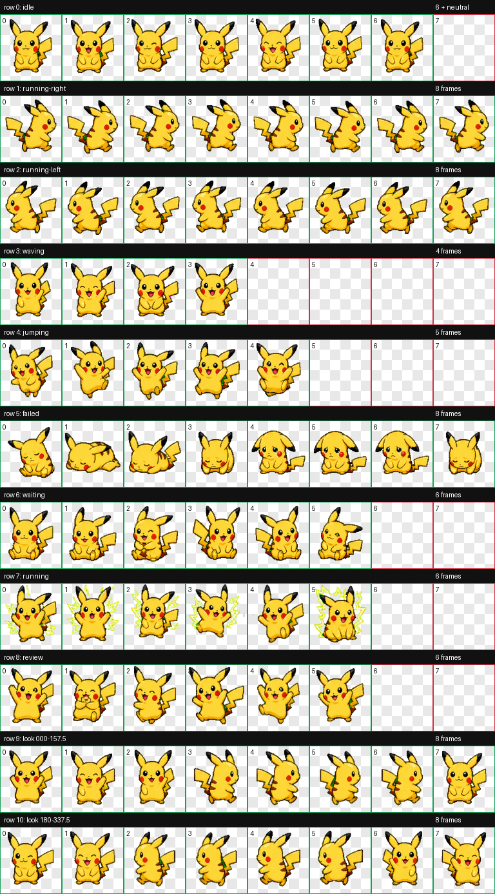
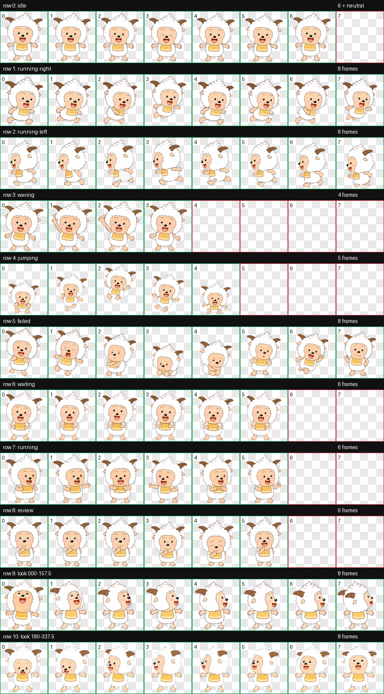
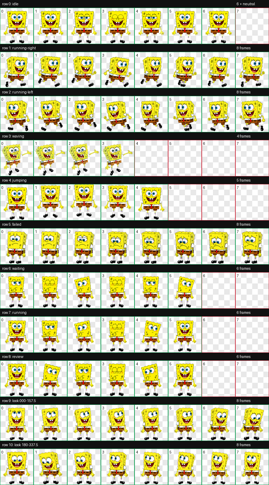

# Codex 动画宠物合集

> [!WARNING]
> 这是非官方同人项目，角色美术不适用本仓库的 MIT 代码许可。本仓库不代表相关游戏、动画、公司或其他权利人的授权、认可或合作。公开、下载、分发或商业使用前，请先阅读对应宠物的版权与风险说明。

适用于 Codex 的 v2 动画宠物合集。每个宠物均包含 9 组标准状态动画和 16 个观察方向。

## 宠物

### 咕咕嘎嘎


- 安装命令：`./install.sh gugugaga`
- 版权说明：[pets/gugugaga/LEGAL_RISK.md](pets/gugugaga/LEGAL_RISK.md)

### 皮卡丘



- 无帽、圆脸大眼版本。
- 安装命令：`./install.sh pikachu`
- 版权说明：[pets/pikachu/LEGAL_RISK.md](pets/pikachu/LEGAL_RISK.md)
- 素材来源及处理说明：[pets/pikachu/SOURCE.md](pets/pikachu/SOURCE.md)

### 懒羊羊



- 青春活力版，包含更明显的跑动、挥手与跳跃动作。
- 安装命令：`./install.sh lan-yangyang`
- 版权说明：[pets/lan-yangyang/LEGAL_RISK.md](pets/lan-yangyang/LEGAL_RISK.md)
- 角色来源及使用边界：[pets/lan-yangyang/SOURCE.md](pets/lan-yangyang/SOURCE.md)

### 哆啦A梦


- 经典蓝色机器猫造型，包含完整 v2 动作与观察方向。
- 安装命令：`./install.sh doraemon`
- 版权说明：[pets/doraemon/LEGAL_RISK.md](pets/doraemon/LEGAL_RISK.md)
- 素材来源及处理说明：[pets/doraemon/SOURCE.md](pets/doraemon/SOURCE.md)

### 海绵宝宝



- 经典黄色方形海绵造型，包含完整 v2 动作、二维挥手动画与观察方向。
- 跳跃采用与咕咕嘎嘎一致的统一比例方案：所有动作使用相同缩放，跳跃五帧固定为 `185px` 高并按 `0/11/18/11/0` 像素轨迹上升；向左动作由完整向右帧逐帧镜像。
- 安装命令：`./install.sh spongebob`
- 版权说明：[pets/spongebob/LEGAL_RISK.md](pets/spongebob/LEGAL_RISK.md)
- 素材来源及处理说明：[pets/spongebob/SOURCE.md](pets/spongebob/SOURCE.md)

## 安装

```bash
git clone https://github.com/zhouzhihui624/gugugaga-codex-pet.git
cd gugugaga-codex-pet
./install.sh gugugaga
./install.sh pikachu
./install.sh lan-yangyang
./install.sh doraemon
./install.sh spongebob
```

安装位置分别为：

- `${CODEX_HOME:-$HOME/.codex}/pets/gugugaga`
- `${CODEX_HOME:-$HOME/.codex}/pets/pikachu`
- `${CODEX_HOME:-$HOME/.codex}/pets/lan-yangyang`
- `${CODEX_HOME:-$HOME/.codex}/pets/doraemon`
- `${CODEX_HOME:-$HOME/.codex}/pets/spongebob`

## 文件

- `pets/gugugaga/`：咕咕嘎嘎宠物包、预览及风险说明。
- `pets/pikachu/`：皮卡丘宠物包、预览、验证结果及风险说明。
- `pets/lan-yangyang/`：懒羊羊宠物包、动作预览、验证结果及风险说明。
- `pets/doraemon/`：哆啦A梦宠物包、预览、验证结果及风险说明。
- `pets/spongebob/`：海绵宝宝宠物包、动作预览、验证结果、来源及风险说明。
- `install.sh`：按宠物 ID 安装到本地 Codex。
- `ASSET_LICENSE.md`：代码与全部角色美术素材的许可边界。

## 许可边界

`install.sh` 和本项目原创配置、文档按 MIT 许可提供。角色名称、角色设计、图片、动画图集及其他第三方或衍生美术素材**不在 MIT 许可范围内**，本仓库也不声称有权授予这些素材的商业使用、再许可或周边制作权。

本项目公开的是可审阅的源文件和安装方式；由于美术权利不明确，它不是一套权利完全清晰的开源美术资产。

## 更新记录

- `2026-07-16`：海绵宝宝跳跃改用咕咕嘎嘎的统一比例方法；待机与其他动作共同匹配到 `185/198` 比例，跳跃保持固定高度并恢复 `18px` 上升轨迹。
- `2026-07-16`：将海绵宝宝挥手动作从风格不一致的 3D 渲染素材替换为用户确认的二维平面素材。
- `2026-07-16`：新增海绵宝宝 v2 宠物；跳跃动作保持主体尺寸稳定，向左动作由完整向右帧逐帧镜像，并附独立来源及版权风险说明。
- `2026-07-15`：修正懒羊羊向右拖动动作，按已认可的左跑逐帧镜像，统一左右跑动的朝向、比例、步态和落脚基线。
- `2026-07-15`：统一使用多动作、多角度总览图作为全部宠物的 README 主预览。
- `2026-07-15`：将咕咕嘎嘎迁移至标准的 `pets/gugugaga/` 目录，安装命令及本地安装位置保持不变。
- `2026-07-15`：新增青春活力版懒羊羊 v2 宠物，包含 9 组标准动作、16 个观察方向和独立版权风险说明。
- `2026-07-15`：新增哆啦A梦 v2 宠物，包含 9 组标准动作、16 个观察方向、来源说明和独立风险提示。
- `2026-07-15`：新增无帽皮卡丘 v2 宠物，包含 9 组标准动作、16 个观察方向、来源说明和独立风险提示。
- `2026-07-12`：统一待机、拖动及其他动作的视觉比例，恢复原跳跃轨迹，并对缩放后的帧进行透明边缘安全的轻度锐化。
