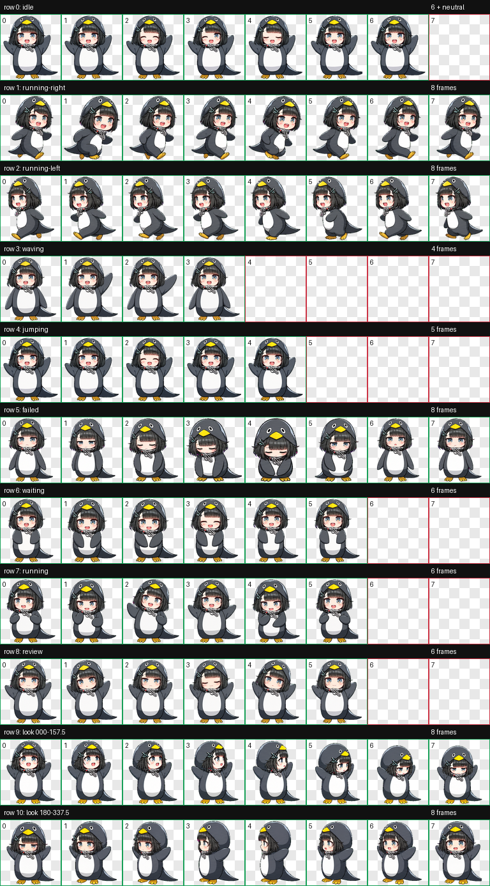

# 咕咕嘎嘎 Codex Pet

> [!WARNING]
> 这是非官方同人项目，角色美术的权利状态存在争议。本仓库不代表《明日方舟：终末地》、鹰角网络、GRYPHLINE、字节跳动或其他权利人的授权、认可或合作。公开、下载、分发或商业使用前，请先阅读 [版权与风险说明](LEGAL_RISK.md)。

一个适用于 Codex 的 v2 动画宠物包。包含 9 组标准状态动画和 16 个观察方向。



## 安装

```bash
git clone https://github.com/zhouzhihui624/gugugaga-codex-pet.git
cd gugugaga-codex-pet
./install.sh
```

安装位置为 `${CODEX_HOME:-$HOME/.codex}/pets/gugugaga`。

## 文件

- `pet.json`：Codex 宠物配置。
- `spritesheet.webp`：`1536x2288` 的 v2 动画图集。
- `preview.png`：动画帧预览。
- `install.sh`：本地安装脚本。
- `LEGAL_RISK.md`：版权来源、风险等级及使用边界。
- `ASSET_LICENSE.md`：代码与美术素材的许可边界。

## 许可边界

`install.sh` 和本项目原创配置、文档按 MIT 许可提供。角色名称、角色设计、图片、动画图集及其他第三方或衍生美术素材**不在 MIT 许可范围内**，本仓库也不声称有权授予这些素材的商业使用、再许可或周边制作权。

本项目公开的是可审阅的源文件和安装方式；由于美术权利不明确，它不是一套权利完全清晰的开源美术资产。

## 更新记录

- `2026-07-12`：悬停动画改为直接复用待机原帧，不做缩放或位移，消除缩小、放大和抖动。
